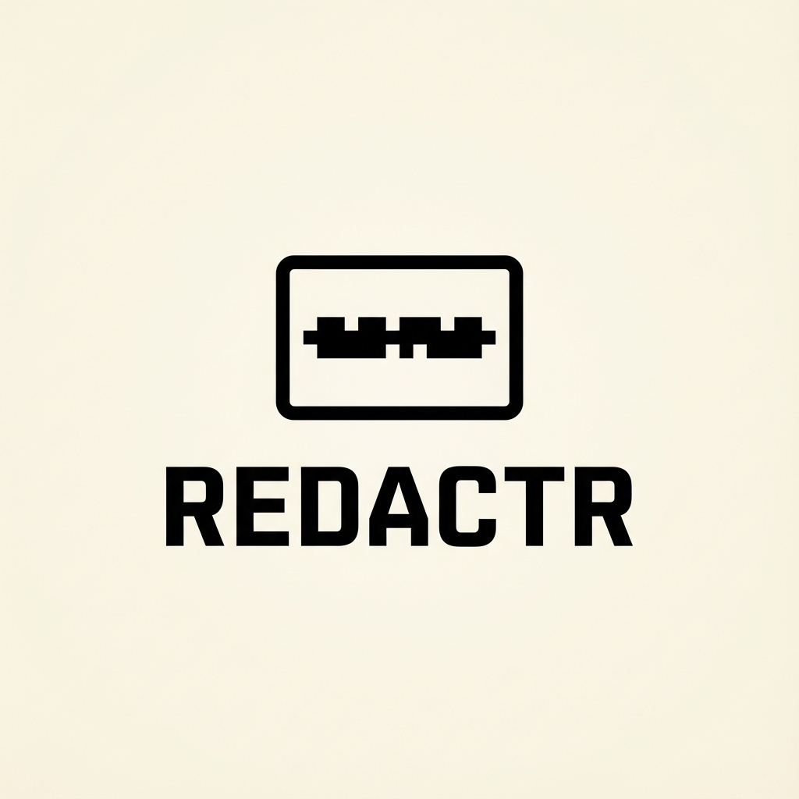

<p align="center">
  
</p>

# Redactr

**Privacy-first image redaction. In your browser. Forever.**

Redactr is a powerful, minimalist tool designed to help you shield sensitive information in images without ever compromising your privacy. Unlike other tools, Redactr processes everything **locally** on your device using Rust and WebAssembly. Your images never leave your browser.

[](https://redactr.app)
[](https://opensource.org/licenses/MIT)

---

## ✨ Features

- 🔒 **100% Local & Private** - All image processing happens in your browser via Rust/WASM. No servers, no uploads, no tracking.
- 🌫️ **Professional Redaction Styles** - Choose between **Gaussian Blur**, **Pixelation**, and **Solid Fill** to best suit your needs.
- 🖌️ **Precise Selection Tools** - Use the **Rectangle Tool** for quick blocks or the **Brush Tool** for freehand redaction.
- 📶 **PWA & Offline Support** - Install Redactr on your desktop or mobile device. Once loaded, it works entirely offline.
- 🎨 **Minimalist Aesthetic** - A clean, distraction-free interface with full support for **Light**, **Dark**, and **System** themes.
- 🔄 **Non-Destructive Editing** - Full **Undo/Redo** history stack with standard keyboard shortcuts (`Ctrl+Z`, `Ctrl+Shift+Z`).
- ⚡ **High Performance** - Powered by a custom Rust engine compiled to WebAssembly for blazing-fast pixel manipulation.

## 🚀 Getting Started

### Prerequisites

- [Node.js](https://nodejs.org/) 18+
- [Rust toolchain](https://rustup.rs/) with `wasm32-unknown-unknown` target
- [wasm-pack](https://rustwasm.github.io/wasm-pack/installer/): `cargo install wasm-pack`

### Installation

```bash
# 1. Clone the repository
git clone https://github.com/yourusername/redactr.git
cd redactr

# 2. Install dependencies
pnpm install

# 3. Build the WASM module
pnpm wasm:build

# 4. Start the development server
pnpm dev
```

### Production Build

```bash
pnpm build
pnpm preview
```

## 🛠️ Tech Stack

- **Frontend**: [Svelte 5](https://svelte.dev/) + [Vite](https://vitejs.dev/)
- **Processing Engine**: [Rust](https://www.rust-lang.org/) + [WebAssembly](https://webassembly.org/)
- **PWA**: `vite-plugin-pwa`
- **Styling**: Vanilla CSS with custom properties

## 🛡️ Privacy Policy

Redactr is built on the principle of **Privacy by Design**. We do not collect, store, or transmit any of your image data. Every pixel manipulation is performed locally in your browser's memory and is cleared as soon as you close the tab.

---

## 📜 License

This project is licensed under the [MIT License](LICENSE).
